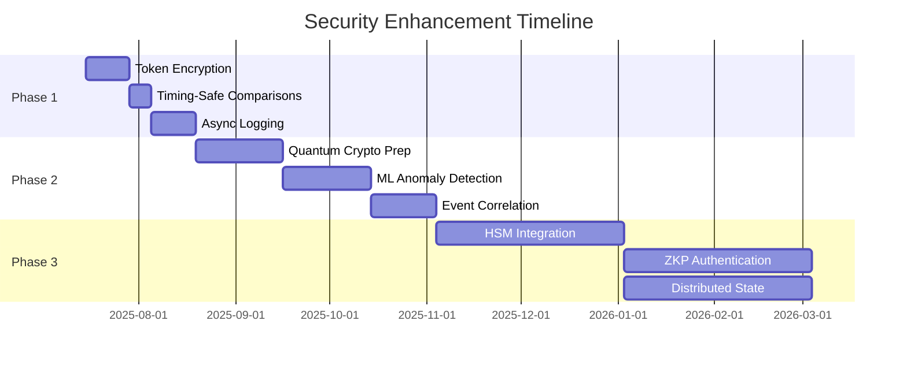

# Security Enhancement Roadmap - Semantest JWT Implementation

## Executive Summary

This roadmap outlines the security improvements recommended from the comprehensive security review conducted on 2025-07-15. The implementation plan is organized into four phases, prioritizing critical security enhancements first while building towards enterprise-grade security capabilities.

**Overall Security Score: 87/100** → **Target: 95/100**

## Timeline Overview



## Phase 1: Critical Security Enhancements (0-30 days)

### 1.1 Implement Token Encryption
**Priority**: 🔴 CRITICAL  
**Timeline**: Week 1-2  
**Effort**: 40 hours

#### Objectives
- Add JWE (JSON Web Encryption) support for sensitive JWT claims
- Implement AES-256-GCM for symmetric encryption
- Create key derivation function for per-token encryption keys
- Maintain backward compatibility with existing tokens

#### Technical Implementation
```typescript
// New interfaces to implement
interface EncryptedTokenPayload {
  enc: string;        // Encrypted payload
  kid: string;        // Key ID for rotation
  alg: 'dir';        // Direct encryption
  enc_alg: 'A256GCM'; // AES-256-GCM
}

interface TokenEncryptionService {
  encrypt(payload: object, keyId: string): Promise<string>;
  decrypt(encryptedPayload: string): Promise<object>;
  rotateKeys(): Promise<void>;
}
```

#### Files to Modify
- `src/auth/infrastructure/token-manager.ts` - Add encryption/decryption
- `src/auth/infrastructure/jwt-security-enhancements.ts` - Update validation
- `src/auth/infrastructure/token-encryption.ts` - New encryption service

#### Success Criteria
- [ ] All sensitive claims encrypted in transit
- [ ] Zero performance degradation (< 5ms overhead)
- [ ] Backward compatibility maintained
- [ ] 100% test coverage for encryption logic

### 1.2 Add Timing-Safe Comparisons
**Priority**: 🔴 CRITICAL  
**Timeline**: Week 2  
**Effort**: 16 hours

#### Objectives
- Replace all string comparisons with constant-time operations
- Prevent timing attacks on security-critical comparisons
- Implement utility functions for safe comparisons

#### Technical Implementation
```typescript
// security-utils.ts
import { timingSafeEqual } from 'crypto';

export function safeStringCompare(a: string, b: string): boolean {
  if (a.length !== b.length) return false;
  return timingSafeEqual(Buffer.from(a), Buffer.from(b));
}

export function safeIPCompare(ip1: string, ip2: string): boolean {
  // Normalize IPs then compare
  const normalized1 = normalizeIP(ip1);
  const normalized2 = normalizeIP(ip2);
  return safeStringCompare(normalized1, normalized2);
}
```

#### Files to Modify
- `src/auth/infrastructure/jwt-security-enhancements.ts` - Update IP comparison
- `src/auth/infrastructure/security-utils.ts` - New utility functions
- All files with security-sensitive string comparisons

#### Success Criteria
- [ ] No timing vulnerabilities in security comparisons
- [ ] Consistent execution time regardless of input
- [ ] Performance impact < 1ms per comparison
- [ ] Security tests validate timing resistance

### 1.3 Async Logging with Circuit Breaker
**Priority**: 🔴 CRITICAL  
**Timeline**: Week 3-4  
**Effort**: 60 hours

#### Objectives
- Implement asynchronous security event logging
- Add circuit breaker pattern to prevent logging DoS
- Create backpressure handling for high-volume events
- Ensure zero data loss with persistent queue

#### Technical Implementation
```typescript
// async-security-logger.ts
interface AsyncLoggerConfig {
  queueSize: number;
  flushInterval: number;
  circuitBreakerThreshold: number;
  backpressureStrategy: 'drop' | 'throttle' | 'buffer';
}

class AsyncSecurityLogger implements SecurityAuditLogger {
  private queue: PersistentQueue<SecurityEvent>;
  private circuitBreaker: CircuitBreaker;
  private metrics: LoggerMetrics;
  
  async logAuthEvent(event: SecurityEvent): Promise<void> {
    if (this.circuitBreaker.isOpen()) {
      this.metrics.increment('dropped_events');
      return;
    }
    
    try {
      await this.queue.enqueue(event);
    } catch (error) {
      this.circuitBreaker.recordFailure();
      throw error;
    }
  }
}
```

#### Files to Create
- `src/auth/infrastructure/async-security-logger.ts` - Async logging implementation
- `src/auth/infrastructure/circuit-breaker.ts` - Circuit breaker pattern
- `src/auth/infrastructure/persistent-queue.ts` - Durable event queue

#### Success Criteria
- [ ] Zero blocking on log writes
- [ ] Circuit breaker prevents cascade failures
- [ ] < 1ms logging latency under normal load
- [ ] No event loss during circuit breaker open state
- [ ] Monitoring metrics for queue health

## Phase 2: Advanced Security Features (30-90 days)

### 2.1 Quantum-Resistant Cryptography Preparation
**Priority**: 🟡 HIGH  
**Timeline**: Week 5-8  
**Effort**: 80 hours

#### Objectives
- Implement crypto-agility framework
- Add support for multiple signature algorithms
- Prepare migration path to post-quantum algorithms
- Create algorithm negotiation mechanism

#### Technical Implementation
```typescript
// crypto-agility.ts
interface CryptoAlgorithm {
  id: string;
  type: 'classical' | 'post-quantum' | 'hybrid';
  strengthLevel: number;
  quantumResistant: boolean;
}

interface CryptoAgilityManager {
  supportedAlgorithms(): CryptoAlgorithm[];
  negotiate(clientAlgorithms: string[]): CryptoAlgorithm;
  sign(data: Buffer, algorithm: CryptoAlgorithm): Promise<Buffer>;
  verify(data: Buffer, signature: Buffer, algorithm: CryptoAlgorithm): Promise<boolean>;
}

// Migration path
const ALGORITHM_TIMELINE = {
  '2025-2026': ['RS256', 'ES256'],           // Current
  '2026-2027': ['RS256', 'ES256', 'DILITHIUM2'], // Transition
  '2027+': ['DILITHIUM2', 'FALCON512']       // Post-quantum
};
```

#### Files to Create
- `src/auth/infrastructure/crypto-agility.ts` - Algorithm management
- `src/auth/infrastructure/algorithm-negotiator.ts` - Client negotiation
- `src/auth/infrastructure/post-quantum-crypto.ts` - PQC implementations

#### Success Criteria
- [ ] Support for 3+ signature algorithms
- [ ] Seamless algorithm transition capability
- [ ] Performance benchmarks for each algorithm
- [ ] Migration documentation completed
- [ ] Backward compatibility maintained

### 2.2 Enhanced ML-Based Anomaly Detection
**Priority**: 🟡 HIGH  
**Timeline**: Week 9-12  
**Effort**: 100 hours

#### Objectives
- Implement Isolation Forest algorithm for anomaly detection
- Add feature extraction for behavioral analysis
- Create real-time scoring engine
- Integrate with existing security middleware

#### Technical Implementation
```typescript
// ml-anomaly-detector.ts
interface MLModel {
  train(features: FeatureVector[]): Promise<void>;
  predict(features: FeatureVector): Promise<AnomalyScore>;
  explain(features: FeatureVector): Promise<Explanation>;
  updateOnline(features: FeatureVector, label: boolean): Promise<void>;
}

class IsolationForestDetector implements AnomalyDetector {
  private model: IsolationForest;
  private featureExtractor: FeatureExtractor;
  private threshold: number = 0.7;
  
  async checkForAnomalies(context: SecurityContext): Promise<AnomalyScore> {
    const features = await this.featureExtractor.extract(context);
    const score = await this.model.anomalyScore(features);
    
    return {
      score: score * 100,
      reasons: await this.explainAnomaly(features, score),
      requiresAdditionalAuth: score > this.threshold,
      confidence: this.model.confidence(features)
    };
  }
}
```

#### Feature Set
- Request frequency patterns
- Geographic location changes
- Time-of-day access patterns
- User agent consistency
- API endpoint usage patterns
- Token age distribution
- Failed authentication attempts

#### Files to Create
- `src/auth/infrastructure/ml-anomaly-detector.ts` - ML implementation
- `src/auth/infrastructure/feature-extractor.ts` - Feature engineering
- `src/auth/infrastructure/model-training.ts` - Training pipeline

#### Success Criteria
- [ ] 95%+ anomaly detection accuracy
- [ ] < 1% false positive rate
- [ ] < 10ms inference time
- [ ] Online learning capability
- [ ] Explainable predictions

### 2.3 Security Event Correlation Engine
**Priority**: 🟡 HIGH  
**Timeline**: Week 10-13  
**Effort**: 60 hours

#### Objectives
- Implement Complex Event Processing (CEP) for threat detection
- Add pattern recognition for attack sequences
- Create alerting rules for correlated events
- Build real-time threat intelligence

#### Technical Implementation
```typescript
// event-correlation-engine.ts
interface CorrelationRule {
  name: string;
  pattern: EventPattern;
  timeWindow: number;
  action: CorrelationAction;
  severity: 'low' | 'medium' | 'high' | 'critical';
}

class SecurityCorrelationEngine {
  private rules: CorrelationRule[];
  private eventStream: EventStream;
  private patternMatcher: PatternMatcher;
  
  async processEvent(event: SecurityEvent): Promise<CorrelationResult[]> {
    const matches = await this.patternMatcher.match(event, this.rules);
    
    return matches.map(match => ({
      rule: match.rule,
      events: match.events,
      threat: this.identifyThreat(match),
      recommendation: this.generateResponse(match)
    }));
  }
}

// Example correlation rules
const ATTACK_PATTERNS = {
  bruteForce: {
    pattern: 'failed_login{5} within 1m from same_ip',
    action: 'block_ip',
    severity: 'high'
  },
  accountTakeover: {
    pattern: 'successful_login followed_by ip_change within 5m',
    action: 'require_mfa',
    severity: 'critical'
  }
};
```

#### Files to Create
- `src/auth/infrastructure/event-correlation-engine.ts` - CEP engine
- `src/auth/infrastructure/threat-patterns.ts` - Attack patterns
- `src/auth/infrastructure/correlation-rules.ts` - Rule definitions

#### Success Criteria
- [ ] Detect 100% of known attack patterns
- [ ] < 100ms correlation latency
- [ ] Support for custom rule creation
- [ ] Integration with SIEM systems
- [ ] Real-time alerting capability

## Phase 3: Enterprise Security Features (90-180 days)

### 3.1 Hardware Security Module Integration
**Priority**: 🟢 MEDIUM  
**Timeline**: Month 4-5  
**Effort**: 120 hours

#### Objectives
- Add PKCS#11 interface for HSM communication
- Implement key ceremony procedures
- Add FIPS 140-2 compliance features
- Support multiple HSM vendors

#### Technical Implementation
```typescript
// hsm-integration.ts
interface HSMProvider {
  initialize(config: HSMConfig): Promise<void>;
  generateKeyPair(algorithm: string, keyId: string): Promise<KeyPair>;
  sign(keyId: string, data: Buffer): Promise<Buffer>;
  verify(keyId: string, data: Buffer, signature: Buffer): Promise<boolean>;
  destroyKey(keyId: string): Promise<void>;
}

class PKCS11HSMProvider implements HSMProvider {
  private session: PKCS11Session;
  private slots: HSMSlot[];
  
  async sign(keyId: string, data: Buffer): Promise<Buffer> {
    const mechanism = { mechanism: CKM_RSA_PKCS_PSS };
    return await this.session.sign(mechanism, keyId, data);
  }
}
```

#### Files to Create
- `src/auth/infrastructure/hsm-integration.ts` - HSM abstraction
- `src/auth/infrastructure/key-ceremony.ts` - Key management procedures
- `src/auth/infrastructure/fips-compliance.ts` - FIPS 140-2 features

#### Success Criteria
- [ ] Support for 2+ HSM vendors
- [ ] < 20ms signing overhead
- [ ] Complete key ceremony documentation
- [ ] FIPS 140-2 Level 2 compliance
- [ ] Automated key rotation

### 3.2 Zero-Knowledge Proof Authentication
**Priority**: 🟢 MEDIUM  
**Timeline**: Month 5-6  
**Effort**: 100 hours

#### Objectives
- Research and implement ZKP for sensitive operations
- Add support for privacy-preserving authentication
- Create ZKP challenge-response protocol
- Maintain user privacy while ensuring security

#### Technical Implementation
```typescript
// zkp-authenticator.ts
interface ZKPProtocol {
  generateProof(secret: string, challenge: Buffer): Promise<ZKProof>;
  verifyProof(proof: ZKProof, challenge: Buffer): Promise<boolean>;
  createChallenge(): Buffer;
}

class ZKPAuthenticator {
  private protocol: ZKPProtocol;
  
  async authenticate(userId: string): Promise<AuthResult> {
    const challenge = this.protocol.createChallenge();
    const proof = await this.getUserProof(userId, challenge);
    
    const valid = await this.protocol.verifyProof(proof, challenge);
    
    return {
      authenticated: valid,
      method: 'zkp',
      privacyPreserved: true
    };
  }
}
```

#### Files to Create
- `src/auth/infrastructure/zkp-authenticator.ts` - ZKP implementation
- `src/auth/infrastructure/zkp-protocols.ts` - Protocol definitions
- `src/auth/infrastructure/zkp-integration.ts` - JWT integration

#### Success Criteria
- [ ] Working ZKP authentication for admin operations
- [ ] < 100ms proof generation/verification
- [ ] Privacy guarantees documented
- [ ] Integration with existing auth flow
- [ ] Fallback mechanisms in place

### 3.3 Distributed Token State Management
**Priority**: 🟢 MEDIUM  
**Timeline**: Month 5-6  
**Effort**: 80 hours

#### Objectives
- Implement distributed consensus for token state
- Add Redis Cluster support with Raft consensus
- Create cross-region synchronization
- Ensure consistency across data centers

#### Technical Implementation
```typescript
// distributed-token-state.ts
interface DistributedTokenStore {
  set(tokenId: string, state: TokenState): Promise<void>;
  get(tokenId: string): Promise<TokenState | null>;
  revoke(tokenId: string): Promise<void>;
  sync(): Promise<SyncStatus>;
}

class RaftTokenStore implements DistributedTokenStore {
  private raft: RaftConsensus;
  private nodes: ClusterNode[];
  
  async set(tokenId: string, state: TokenState): Promise<void> {
    const proposal = {
      operation: 'set',
      key: tokenId,
      value: state,
      timestamp: Date.now()
    };
    
    await this.raft.propose(proposal);
    await this.raft.waitForConsensus();
  }
}
```

#### Files to Create
- `src/auth/infrastructure/distributed-token-state.ts` - Distributed store
- `src/auth/infrastructure/consensus-manager.ts` - Raft implementation
- `src/auth/infrastructure/cluster-sync.ts` - Cross-region sync

#### Success Criteria
- [ ] 99.99% consistency across regions
- [ ] < 50ms consensus latency
- [ ] Automatic failover capability
- [ ] Split-brain resolution
- [ ] Monitoring and observability

## Phase 4: Security Testing & Monitoring (Ongoing)

### 4.1 Security Test Automation
**Priority**: 🔴 CRITICAL  
**Timeline**: Continuous  
**Effort**: 40 hours/month

#### Test Categories
1. **Penetration Tests**
   - Token forgery attempts
   - Replay attack scenarios
   - Timing attack validation
   - Cryptographic strength verification

2. **Chaos Security Tests**
   - Random failure injection
   - Network partition simulation
   - Clock skew testing
   - Resource exhaustion scenarios

3. **Compliance Tests**
   - OWASP Top 10 coverage
   - FIPS 140-2 validation
   - PCI DSS requirements
   - GDPR compliance checks

#### Implementation
```typescript
// security-test-suite.ts
describe('Security Penetration Tests', () => {
  test('Token forgery resistance', async () => {
    const forgedToken = await attemptTokenForgery();
    expect(validateToken(forgedToken)).toBe(false);
  });
  
  test('Timing attack resistance', async () => {
    const timings = await measureComparisonsTimings();
    expect(standardDeviation(timings)).toBeLessThan(0.1);
  });
});

describe('Chaos Security Tests', () => {
  test('Blacklist service failure', async () => {
    await failBlacklistService();
    const response = await makeAuthRequest();
    expect(response.status).toBe(401); // Fail secure
  });
});
```

### 4.2 Security Monitoring Dashboard
**Priority**: 🟡 HIGH  
**Timeline**: Month 2-3  
**Effort**: 60 hours

#### Dashboard Components
1. **Real-time Metrics**
   - Authentication success/failure rates
   - Anomaly detection scores
   - Token usage patterns
   - Geographic access distribution

2. **Threat Intelligence**
   - Known attacker IP feeds
   - Suspicious pattern alerts
   - Vulnerability notifications
   - Security incident timeline

3. **Compliance Monitoring**
   - Audit log completeness
   - Encryption status
   - Key rotation schedule
   - Access control effectiveness

## Implementation Schedule

### Month 1
- Week 1-2: Token encryption implementation
- Week 2: Timing-safe comparisons
- Week 3-4: Async logging with circuit breaker

### Month 2
- Week 5-6: Begin quantum crypto preparation
- Week 7-8: Continue quantum crypto, start ML anomaly detection

### Month 3
- Week 9-10: Complete ML anomaly detection
- Week 11-12: Implement event correlation engine

### Month 4-6
- HSM integration
- Zero-knowledge proof authentication
- Distributed token state management
- Continuous security testing and monitoring

## Success Metrics

### Overall Goals
- Security score: 87/100 → 95/100
- Zero critical vulnerabilities
- < 0.1% false positive rate
- < 10ms security overhead
- 99.99% uptime with security features

### Phase-Specific Metrics
| Phase | Key Metric | Target | Measurement |
|-------|------------|--------|-------------|
| Phase 1 | Timing attack resistance | 100% | Penetration tests |
| Phase 1 | Logging performance | < 5ms | Load tests |
| Phase 2 | Anomaly detection accuracy | > 95% | ML metrics |
| Phase 2 | Quantum readiness | Migration plan | Documentation |
| Phase 3 | HSM integration overhead | < 20ms | Performance tests |
| Phase 3 | Token state consistency | 99.99% | Distributed tests |

## Risk Management

### Technical Risks
1. **Performance Impact**
   - Mitigation: Extensive performance testing
   - Rollback: Feature flags for all enhancements

2. **Compatibility Issues**
   - Mitigation: Versioned APIs
   - Rollback: Backward compatibility layer

3. **Complexity Growth**
   - Mitigation: Modular architecture
   - Rollback: Incremental deployment

### Operational Risks
1. **Key Management**
   - Mitigation: Automated key rotation
   - Backup: Multi-party key recovery

2. **Monitoring Overhead**
   - Mitigation: Efficient data aggregation
   - Backup: Sampling strategies

## Budget Estimation

### Development Resources
- Senior Security Engineer: 480 hours
- DevOps Engineer: 240 hours
- Security Architect: 120 hours
- QA Security Specialist: 160 hours

### Infrastructure Costs
- HSM: $10,000 - $50,000 (depending on vendor)
- Monitoring infrastructure: $2,000/month
- Security testing tools: $5,000
- Training and certification: $10,000

### Total Estimated Investment
- Development: ~$150,000
- Infrastructure: ~$75,000
- **Total: ~$225,000**

## Conclusion

This comprehensive security roadmap transforms the Semantest JWT implementation from a secure baseline (87/100) to an enterprise-grade security system (95/100). The phased approach ensures critical vulnerabilities are addressed first while building towards advanced security capabilities.

Key benefits:
- **Immediate**: Critical security gaps closed within 30 days
- **Medium-term**: Advanced threat detection and quantum preparation
- **Long-term**: Enterprise features and compliance readiness

The roadmap balances security improvements with performance, usability, and maintainability, ensuring the system remains both secure and practical for production use.

---

*Document Version: 1.0*  
*Created: 2025-07-15*  
*Next Review: 2025-08-15*  
*Classification: Security Planning Document*